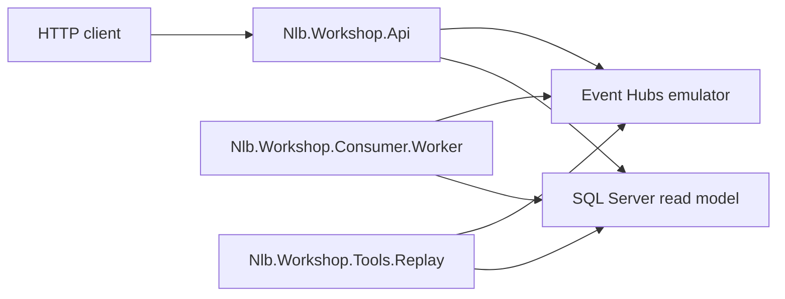
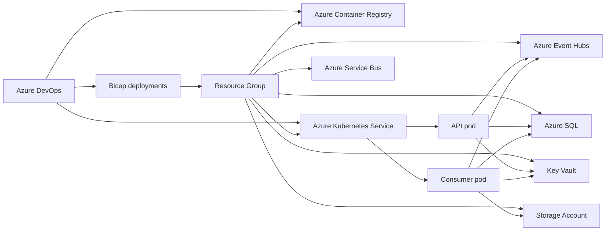
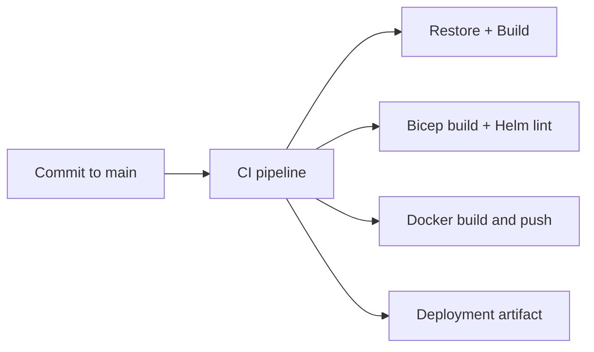
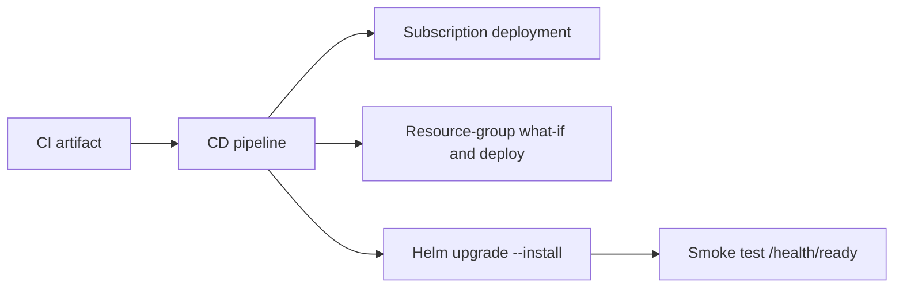

# Azure Architecture

## Local to Azure Mapping

- Event Hubs emulator -> Azure Event Hubs namespace
- Azurite Blob -> Azure Storage Blob container
- local SQL Server container -> Azure SQL Database
- Docker compose -> AKS + Helm
- manual local run -> Azure DevOps CI/CD

## Local Architecture

## Azure Target Architecture

## CI Flow

## CD Flow

## Runtime Secret Model

- infra creates runtime connection strings and stores them in Key Vault
- AKS Secret Store CSI driver syncs them into a Kubernetes secret
- Helm injects them as environment variables for API and worker
- the app itself reads resolved values from standard configuration

## Why Azure SQL

The workshop now uses SQL Server locally and Azure SQL in deployment. That keeps the same relational model and migration path across environments instead of teaching one database engine locally and another in production.
